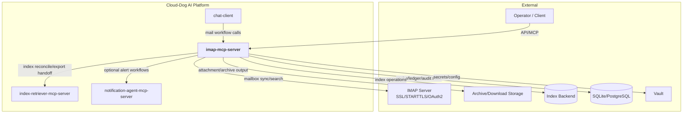
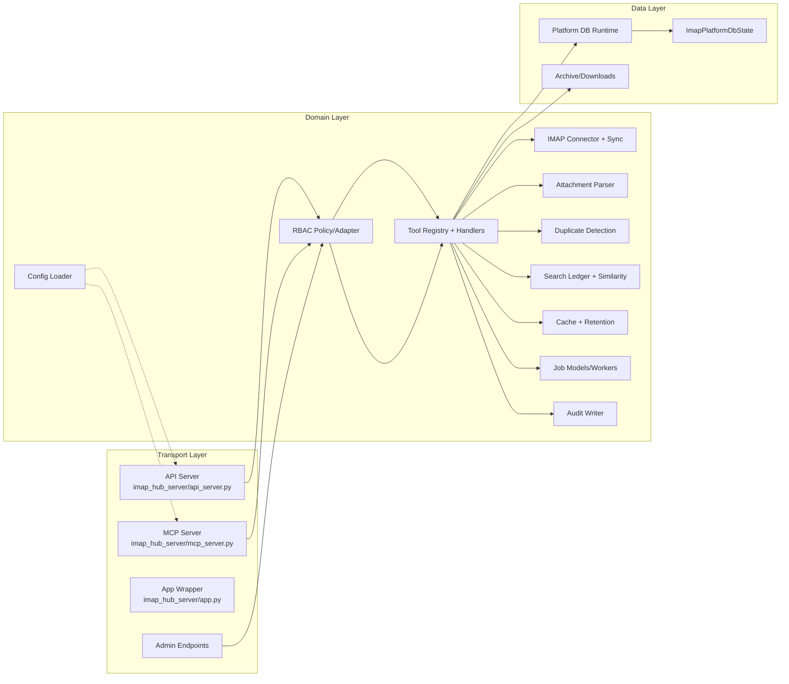
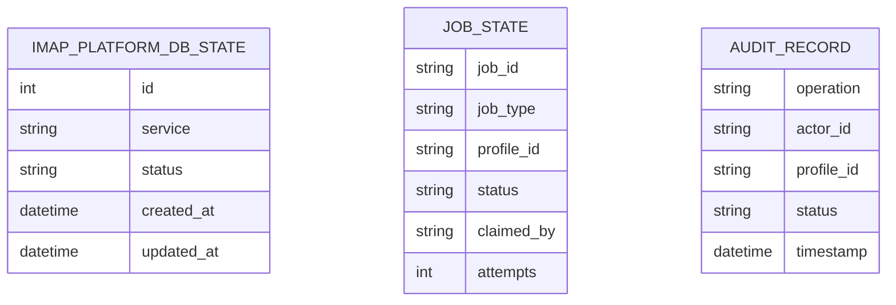
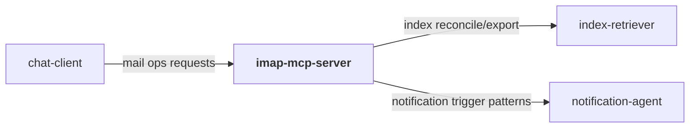
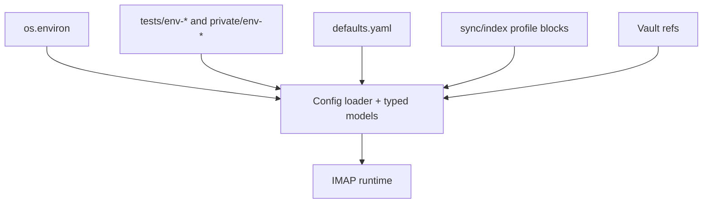
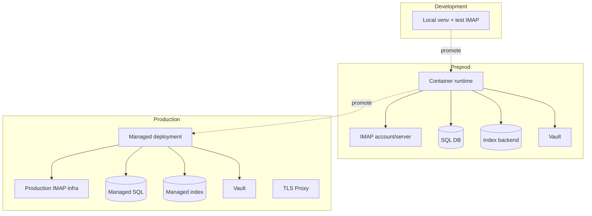
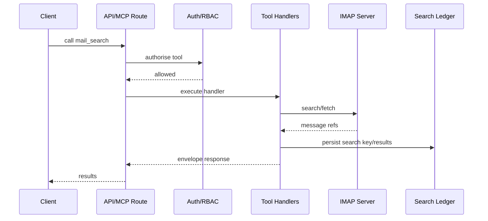
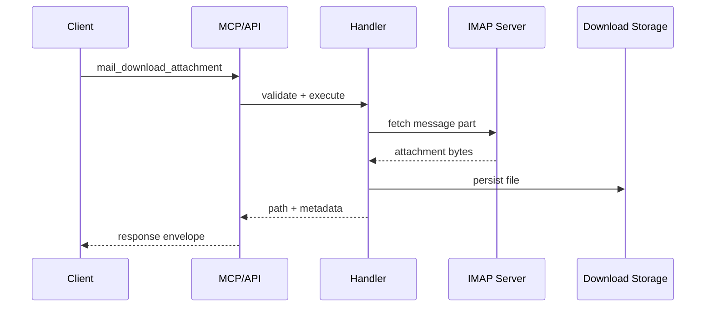

# IMAP MCP Server — Architecture

## W28A-421 Review Status
- Reviewed for external/shareable publication during W28A-421.
- Source basis: `defaults.yaml`, 6 server/transport source files (`api_server.py`, `mcp_server.py`, `a2a_server.py`, `web_server.py`, `admin/endpoints.py`, `main.py`), 65 discovered routes/endpoints, and 29 MCP tools.
- Internal-only absolute paths, environment-specific hosts, and private registries have been removed from this shareable document set.

## 1. Overview
`imap-mcp-server` is a mailbox integration service that exposes IMAP sync/search/extract tooling through API and MCP transports, with admin controls for profiles, indexing, archive/export, and RBAC policy management.

The implementation is split into `imap_hub_core` (domain logic) and `imap_hub_server` (transport/runtime), enabling the same tool contracts across HTTP API, MCP, and A2A-compatible surfaces.

It is used for email intelligence workflows, attachment extraction, and downstream indexing integration in the Cloud-Dog AI platform.

## 2. System Context Diagram

The service acts as the platform email operations adapter with deterministic tooling and governance controls.

## 3. Component Architecture

Transport and domain separation ensures protocol compatibility while keeping IMAP behaviour and policy logic centralised.

## 4. Module Decomposition
| Module | Path | Responsibility | Platform Package |
|---|---|---|---|
| API server | `src/imap_hub_server/api_server.py` | Health, tool routes, A2A compatibility, admin wiring, jobs admin | `cloud_dog_api_kit` |
| MCP server | `src/imap_hub_server/mcp_server.py` | `/mcp` and `/mcp/tools` transport routes | `cloud_dog_api_kit` |
| A2A server | `src/imap_hub_server/a2a_server.py` | A2A agent card, health, and tool routes | `cloud_dog_api_kit` |
| Web server | `src/imap_hub_server/web_server.py` | Auth UI, runtime-config, static assets, status | — |
| Admin endpoints | `src/imap_hub_server/admin/endpoints.py` | Profile, user, group, RBAC, API-key, audit, logs, and settings admin routes | — |
| Admin state | `src/imap_hub_server/admin/state.py` | Admin state persistence and mutation helpers | — |
| Auth middleware | `src/imap_hub_server/auth/middleware.py` | API-key/JWT and compatibility auth hooks | `cloud_dog_idam` |
| Entrypoint | `src/imap_hub_server/main.py` | Server bootstrap and lifecycle | — |
| Tool registry/handlers | `src/imap_hub_core/tools/handlers.py` | Mail operations contract and execution | — |
| IMAP connectivity | `src/imap_hub_core/imap/*` | Connection, sync cursoring, folder policy | — |
| Attachment/extract | `src/imap_hub_core/attachment/*`, `extract/*` | MIME/attachment parsing and extraction | — |
| Ledger/cache/duplicate | `src/imap_hub_core/ledger/*`, `cache/*`, `duplicate/*` | Search memory and de-duplication | — |
| Jobs | `src/imap_hub_core/jobs/*` | Config-driven queue backend, worker dispatch, retry, persisted state projection | `cloud_dog_jobs` |
| Config | `src/imap_hub_core/config/*` | Typed config model + loader | `cloud_dog_config` |
| Persistence | `src/imap_hub_core/db/models.py`, `runtime.py` | DB runtime and state table | `cloud_dog_db` |
| Audit | `src/imap_hub_core/audit/*` | Audit event and JSONL writing | `cloud_dog_logging` |

## 5. Data Model

Relational persistence is represented by `imap_platform_db_state` plus the `cloud_dog_jobs` backend tables for queued jobs. A local `job_state.json` projection persists attempt counts, claimed worker identity, and last-error state across runtime restarts.

## 6. Interface Specifications
### 6.1 REST API
| Method | Path | Description | Auth |
|---|---|---|---|
| GET | `/health` | Service health | None |
| GET | `/api/v1/health` | Canonical health | None |
| GET | `/a2a/health` | A2A health contract | API key |
| GET | `/api/v1/tools` | Tool catalogue | API key/JWT |
| POST | `/api/v1/tools/{tool_name}` | Tool execution | API key/JWT |
| GET | `/status` | Process metrics | API key |
| GET | `/api/v1/admin/profiles` | Profile list | Admin role |
| POST | `/api/v1/admin/profiles` | Create profile | Admin role |
| PUT | `/api/v1/admin/profiles/{profile_id}` | Profile update | Admin role |
| DELETE | `/api/v1/admin/profiles/{profile_id}` | Delete profile | Admin role |
| POST | `/api/v1/admin/index/reconcile` | Index reconcile task | Admin role |
| POST | `/api/v1/admin/archive/export` | Archive export | Admin role |
| GET | `/api/v1/admin/jobs` | Job list | Jobs read |
| GET | `/api/v1/admin/jobs/queue/status` | Queue counters | Jobs read |
| GET | `/api/v1/admin/jobs/{job_id}` | Job detail | Jobs read |
| POST | `/api/v1/admin/jobs/{job_id}/cancel` | Cancel job | Jobs write |
| POST | `/api/v1/admin/jobs/{job_id}/retry` | Retry job | Jobs write |
| DELETE | `/api/v1/admin/jobs/{job_id}` | Archive job | Admin role |
| GET | `/api/v1/admin/logs` | Server logs | Admin role |

### 6.2 MCP Tools
| Tool | Description | Category |
|---|---|---|
| `profile_list` | List configured profiles | profile |
| `mail_probe` | IMAP connectivity probe | connectivity |
| `mail_search`, `mail_search_since_last`, `mail_headlines` | Search workflows | search |
| `mail_get_message`, `mail_extract_message` | Message retrieval/extraction | message |
| `mail_list_attachments`, `mail_download_attachment` | Attachment workflows | attachment |
| `mail_move_duplicates_since_last_search` | Duplicate handling | hygiene |
| `mail_set_seen`, `mail_move_messages`, `mail_delete_messages` | Mutation operations | write |

### 6.3 A2A Endpoints
| Endpoint | Description | Protocol |
|---|---|---|
| `/a2a/health` | A2A compatibility health | HTTP GET |
| `/a2a/tools` | A2A tool catalogue | HTTP GET |
| `/a2a/tools/{tool_name}` | A2A tool execution | HTTP POST |

## 7. Dependencies & External Services
### 7.1 Platform Packages
| Package | Version | Usage in this project |
|---|---|---|
| `cloud_dog_config` | `>=0.2.0` | Config model/loader |
| `cloud_dog_logging` | `>=0.2.0` | Audit/log output |
| `cloud_dog_api_kit` | `>=0.2.0` | API/MCP route integration |
| `cloud_dog_idam` | `>=0.2.0` | Auth middleware and RBAC hooks |
| `cloud_dog_jobs` | `>=0.2.0` | Job lifecycle primitives |
| `cloud_dog_db` | `>=0.1.0` | DB runtime and models |

### 7.2 External Services
| Service | Purpose | Connection | Vault Path |
|---|---|---|---|
| IMAP server | Mail sync/search/fetch | profile IMAP credentials + TLS/OAuth | `dev.imap.*` |
| Index backend | Search index reconcile/write | `index.*` config | `dev.index.*` |
| Filesystem/archive storage | Downloads/exports | storage config | `dev.storage.*` |
| SQL database | platform state | db runtime config | `dev.databases.*` |
| Vault | secret retrieval | env/vault bridge | `secret/*` |

### 7.3 Cross-Project Dependencies

## 8. Configuration Architecture

Primary roots are `server`, `sync`, `index`, `rbac`, and `jobs`, with nested profile settings for auth, retention, archive, limits, queue backend selection, retry policy, and maintenance thresholds.

### 8.1 Cache Package Posture

IMAP currently has two local cache-like structures, and neither is classified as a `cloud_dog_cache` migration target:

- `imap_hub_core.cache.store.CacheStore` stores typed `CachedMessage` records and supports message-retention workflows keyed by mailbox message metadata. It is a domain store used by IMAP tools and tests, not a generic key/value, memoization, or cross-service application cache.
- `ToolHandlers._folder_list_cache` stores live IMAP folder-list responses for one process with a bounded TTL. It avoids repeated folder enumeration during a mailbox workspace session and is intentionally ephemeral.

Approved exception: keep these structures local unless they grow into shared cache infrastructure, cross-process cache state, or generic application memoization. A future migration to `cloud_dog_cache` is appropriate only if the cache package exposes a typed record/retention pattern that preserves IMAP message semantics without flattening mailbox metadata into arbitrary keys.

## 9. Security Architecture
- Authentication: auth middleware for API/MCP/A2A paths.
- Authorisation: RBAC policy checks at tool and admin endpoints.
- Secrets: IMAP credentials and provider tokens resolved through runtime config/Vault.
- Audit: tool operations emit structured audit records.
- Network: explicit health/readiness and segregated API/MCP base paths.

## 10. Deployment Architecture

## 11. Key Flows
### 11.1 Mail Search and Retrieval Flow

### 11.2 Attachment Extraction Flow

## 12. Non-Functional Characteristics
| Characteristic | Approach |
|---|---|
| Scalability | Profile-based segmentation and tool-level execution contracts |
| Reliability | Health routes, ledger/cursor mechanisms, and deterministic envelopes |
| Observability | Structured audit logs and admin diagnostics endpoints |
| Performance | Targeted IMAP queries with cache and similarity-ledger support |
| Maintainability | Clean `imap_hub_core` vs `imap_hub_server` decomposition |
